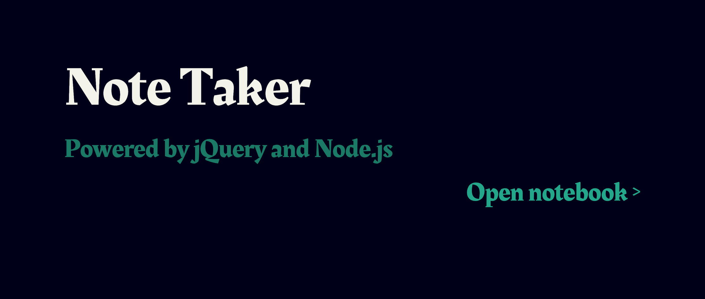

# notes-app
Quickly record your thoughts and save them to a convenient and enjoyable interface

## technologies used

  * jQuery
  * Bootstrap

The following npm packages are required:
  * express
  * uuid

## app screenshots

The user is presented with the following interfaces:

 * The user lands on a homepage, which is revealed with a sliding bar animation: 
 * The user can create and save notes to their list: 

## user story

This app was developed based off of the following user requirements:

AS A user, I want to be able to write and save notes

I WANT to be able to delete notes I've written before

SO THAT I can organize my thoughts and keep track of tasks I need to complete

Application should allow users to create and save notes.

Application should allow users to view previously saved notes.

Application should allow users to delete previously saved notes.
